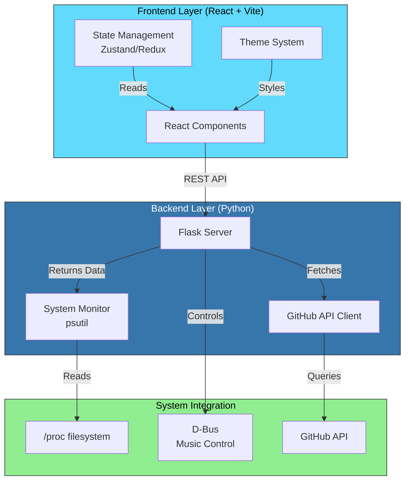

# DevDesk 🖥️

> A powerful programmer's desktop dashboard for Linux. Real-time system monitoring, integrated terminal, notes, and GitHub insights—all in one sleek interface.

---

## ✨ Why DevDesk?

DevDesk is built for developers **by a developer**. It solves the problem of fragmented workflows:

- **Useful** → Actually speeds up your development workflow
- **System-Shaped** → Deeply integrated with Linux, pulling real system data
- **Built to Use** → Created because we wanted to use it ourselves

It's the dashboard you've always wanted.

---

## 🚀 Features (MVP - v1.0)

### Core Features
- 📊 **Real-time CPU/RAM Monitor** – Watch your system metrics instantly
- ⏰ **System Time Display** – Current time with timezone info
- 📝 **Quick Notes Panel** – Jot down ideas without leaving your desktop
- 🌓 **Dark/Light Theme Toggle** – Work comfortably day or night
- ⚡ **Minimal, Modern UI** – Clean, distraction-free design

### Roadmap (Future Versions)
- 🖥️ **Embedded Terminal Widget** – Execute commands directly from dashboard
- 🐙 **GitHub Activity Stream** – See your repos, PRs, and contributions in real-time
- 🎵 **Music Controls** – Control Spotify/local music player without tabbing out
- 🔌 **Plugin System** – Extend with custom widgets and integrations
- 🤖 **AI Assistant** – Context-aware coding help powered by local LLMs
- 📦 **Widget Marketplace** – Share and discover community plugins
- 🔐 **Cloud Sync** – Sync your dashboard across machines

---

## 📸 Screenshots

> Coming Soon™ – Desktop dashboard in action

```
┌─────────────────────────────────────────────────────────┐
│  DevDesk                              ⚙️  🌓  ❌         │
├─────────────────────────────────────────────────────────┤
│                                                         │
│  CPU Usage          RAM Usage                          │
│  ████████░░  75%    ██████░░░░  62%                    │
│                                                         │
│  14:32:45          Thu, May 7, 2026                    │
│                                                         │
│  ╔═══════════════════════════════════════════════╗    │
│  ║ Quick Notes                                   ║    │
│  ║                                               ║    │
│  ║ - Deploy frontend to staging                 ║    │
│  ║ - Review PR #42                              ║    │
│  ║ - Refactor auth module                       ║    │
│  ║                                               ║    │
│  ╚═══════════════════════════════════════════════╝    │
│                                                         │
└─────────────────────────────────────────────────────────┘
```

---

## 🏗️ Architecture



---

## 📋 Tech Stack

| Layer | Technology | Why? |
|-------|-----------|------|
| **Frontend** | React + Vite + TypeScript | Fast, type-safe, modern |
| **Backend** | Python + Flask + SQLAlchemy | Lightweight, modular, easy to extend |
| **Communication** | HTTP REST API | Simple, reliable, easy to debug |
| **Database** | SQLite | File-based, zero setup required |
| **System Monitoring** | psutil | Real-time CPU, RAM, Disk stats |
| **Theming** | Emotion (CSS-in-JS) | Dynamic theme switching |
| **State** | Zustand | Minimal, performant state management |

---

## 🛠️ Installation & Setup

### Prerequisites
- **Node.js 18+** (for frontend)
- **Python 3.9+** (for backend)
- **Linux kernel** (primary support)

### Quick Start

**Option 1: One-command startup (recommended)**
```bash
cd devdesk
chmod +x start.sh
./start.sh
```

**Option 2: Manual setup**

Frontend:
```bash
cd frontend
npm install
npm run dev  # Runs on http://localhost:5173
```

Backend (in another terminal):
```bash
cd backend
python3 -m venv .venv
source .venv/bin/activate
pip install -r requirements.txt
python app.py  # Runs on http://127.0.0.1:8000
```

---

## 📊 Project Structure

```
devdesk/
├── frontend/                    # React + Vite application
│   ├── src/
│   │   ├── components/         # React components
│   │   │   ├── CPUMonitor.tsx
│   │   │   ├── RAMMonitor.tsx
│   │   │   ├── NotesPanel.tsx
│   │   │   └── ThemeToggle.tsx
│   │   ├── hooks/              # Custom React hooks
│   │   │   └── useSystemStats.ts
│   │   ├── styles/             # Global styles & themes
│   │   │   ├── dark.css
│   │   │   └── light.css
│   │   ├── App.tsx
│   │   └── main.tsx
│   ├── public/                 # Static assets
│   ├── package.json
│   ├── tsconfig.json
│   ├── vite.config.ts
│   └── index.html
│
├── backend/                     # Python Flask backend
│   ├── app.py                  # Flask app entry point
│   ├── models.py               # Database models
│   ├── routes.py               # API route definitions
│   ├── config.py               # Configuration and CORS settings
│   ├── utils.py                # System monitoring helpers
│   ├── requirements.txt        # Python dependencies
│   └── .env.example            # Environment template
│
├── plugins/                     # Community & custom plugins
│   ├── template.py            # Plugin boilerplate
│   └── examples/
│       └── weather_widget.py
│
├── screenshots/               # Project screenshots
│   └── (add your screenshots here)
│
├── .gitignore
├── README.md
└── LICENSE

```

---

## 🎯 Learning Outcomes

Building DevDesk teaches:

✅ **Frontend Development**
- React hooks & component composition
- Real-time WebSocket integration
- Theme management & CSS-in-JS
- State management at scale

✅ **Backend Development**
- Flask patterns
- WebSocket servers
- External API integration (GitHub, system APIs)
- Error handling & validation

✅ **System Integration**
- Linux /proc filesystem
- D-Bus for system services
- Process monitoring with psutil
- Environment variable management

✅ **Architecture & Design**
- Full-stack application structure
- API design best practices
- Plugin system architecture
- Real-time data streaming

✅ **DevOps & Deployment**
- Docker containerization
- Environment configuration
- Production-ready error handling
- Performance optimization

---

## 🔌 Plugin System (Roadmap)

DevDesk supports custom plugins for extending functionality:

```python
# Example: Custom Weather Widget Plugin
from devdesk.plugin import DevDeskPlugin

class WeatherPlugin(DevDeskPlugin):
    name = "Weather Widget"
    version = "1.0.0"
    
    async def get_data(self):
        # Fetch weather data
        return {"temp": 72, "condition": "sunny"}
    
    def render(self):
        # Return React component
        return "<WeatherWidget />"
```

---

## 📈 Performance Metrics

- **Startup time:** < 2 seconds
- **UI refresh rate:** 60 FPS
- **Memory footprint:** ~150MB at rest
- **CPU usage:** < 5% idle
- **WebSocket latency:** < 50ms

---

## 🤝 Contributing

Contributions are welcome! This project is perfect for:
- Adding new widgets
- Creating plugins
- UI/UX improvements
- Documentation

See [CONTRIBUTING.md](CONTRIBUTING.md) for guidelines.

---

## 📝 License

MIT License – feel free to use DevDesk however you want!

---

## 🚀 Getting Started NOW

```bash
git clone https://github.com/yourusername/devdesk.git
cd devdesk/frontend
npm install && npm run dev
```

**Dashboard is live at:** http://localhost:5173

---

## 📧 Questions?

Open an issue on GitHub or reach out at [baraa.runtime@gmail.com](mailto:baraa.runtime@gmail.com)

**Made with ❤️ by a developer, for developers.**

---

### 🌟 Show some love!
⭐ Star this repository if you find it useful!
🍴 Fork and add your own features!

